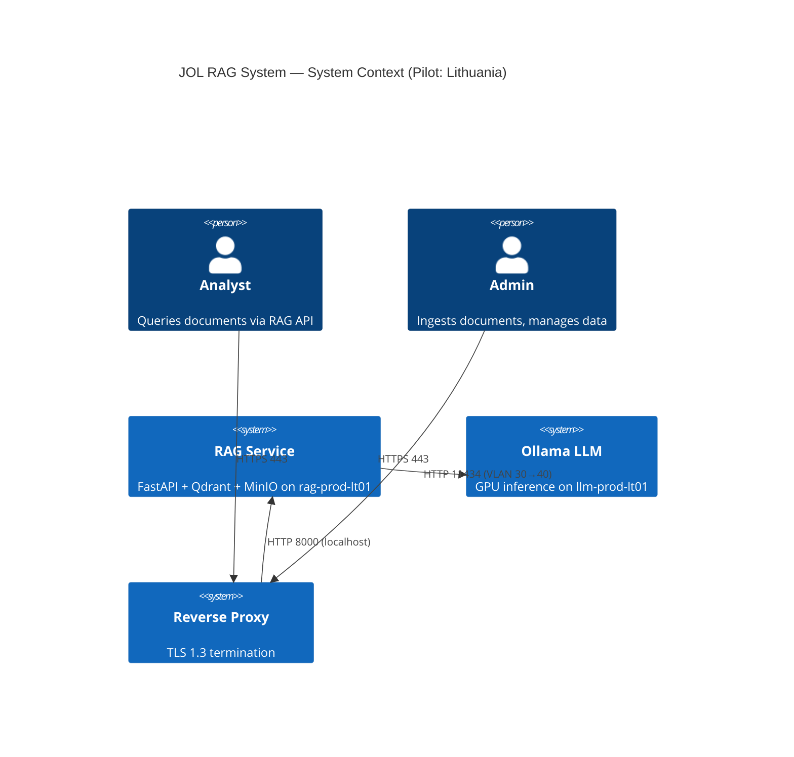
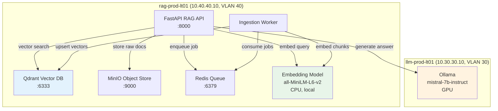
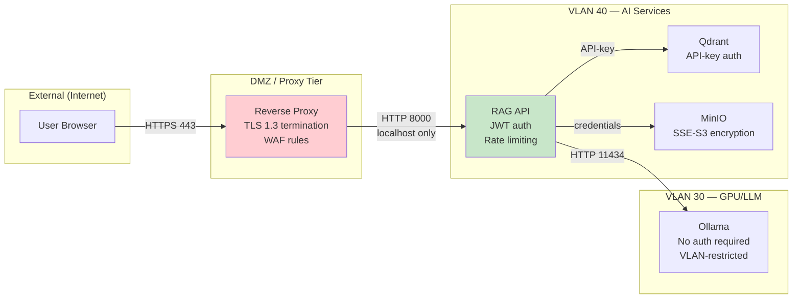

# RAG System Architecture

## System Context

## Data Flow

## Trust Boundaries

## Network Topology

| Segment | VLAN | Subnet | Purpose |
|---------|------|--------|---------|
| AI Services | 40 | 10.40.40.0/24 | RAG, MCP, Hermes VMs |
| GPU/LLM | 30 | 10.30.30.0/24 | Ollama inference (bare-metal) |
| Management | 60 | 10.60.60.0/24 | Proxmox hypervisor, bastion |
| Backup | 10 | 10.10.10.0/24 | PBS backup server |

## Encryption Layers

| Layer | Mechanism | Standard |
|-------|-----------|----------|
| Data at rest (block) | LUKS2 (AES-XTS-256) | GDPR Art. 32 |
| Data at rest (object) | MinIO SSE-S3 | AES-256-GCM |
| Data in transit (external) | TLS 1.3 at reverse proxy | ISO 27001 A.13.2 |
| Data in transit (internal) | VLAN isolation + API keys | Risk accepted (pilot) |
| Backups | age encryption (X25519) | SOC 2 CC6.1 |

## Design Decisions

| Decision | Rationale |
|----------|-----------|
| Ollama on llm-prod-lt01 (not local) | RAG VM has no GPU; Ollama already provisioned with GPU |
| all-MiniLM-L6-v2 embeddings | CPU-friendly (384-dim), fast, no external API calls |
| Docker Compose (not K8s) | Pilot simplicity; single VM; extractable later |
| Qdrant (not Pinecone/Weaviate) | Self-hosted, EU data residency, API-key auth |
| MinIO (not S3) | Self-hosted, SSE-S3, no cloud dependency |
| JWT HS256 (not OIDC) | Pilot phase; structure supports RS256 migration |
| mTLS deferred | Pilot risk acceptance; VLAN isolation compensates |
